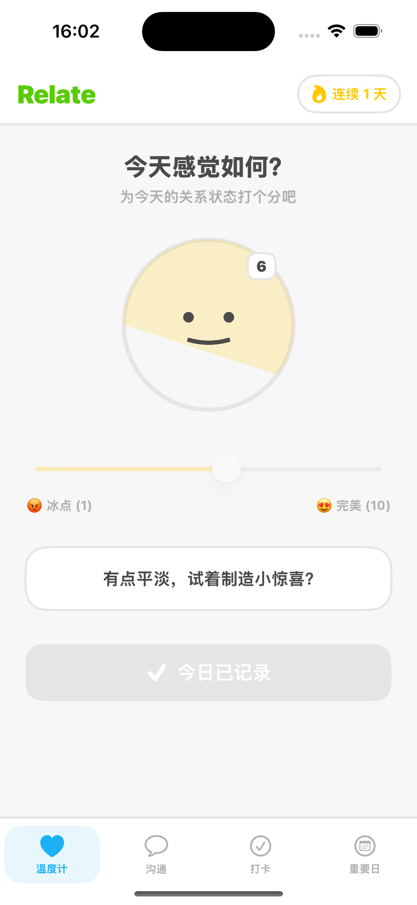
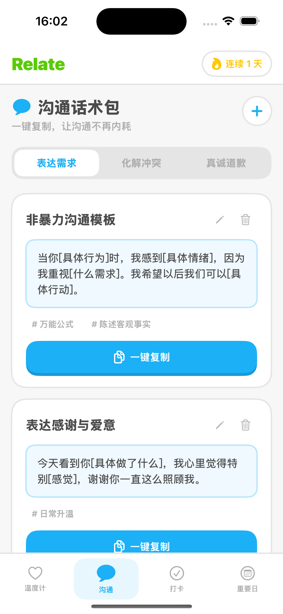
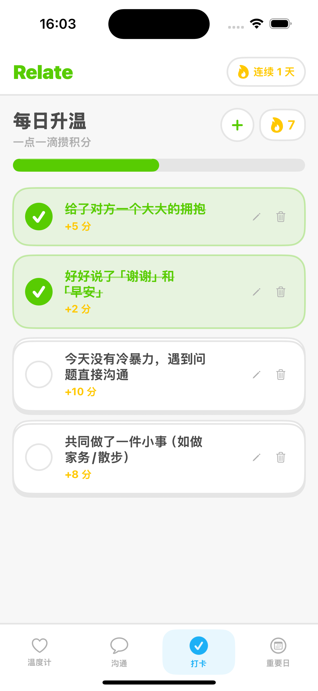
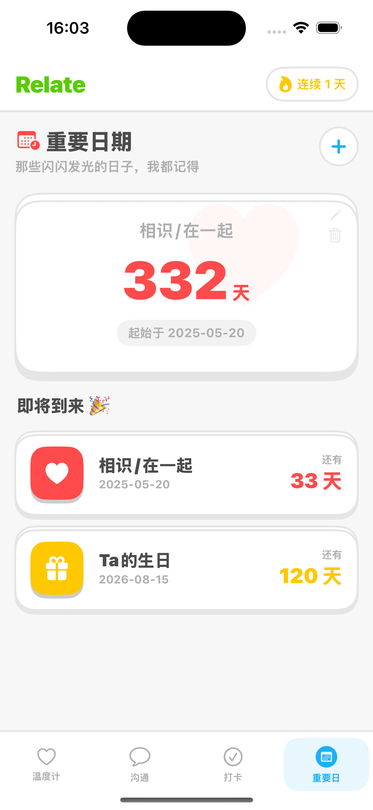
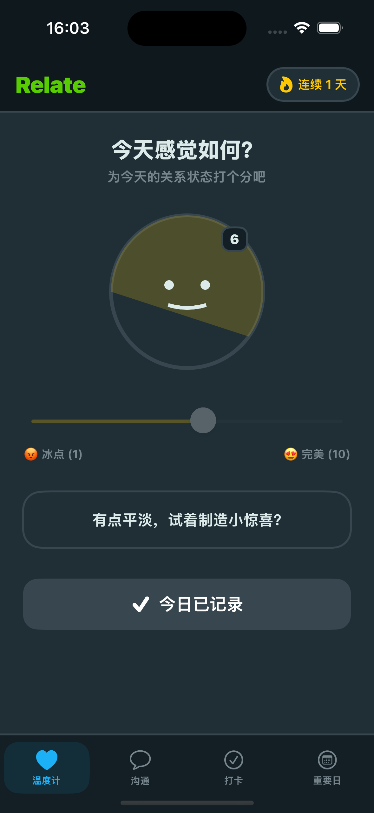
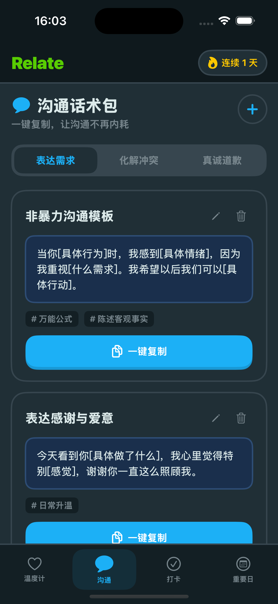
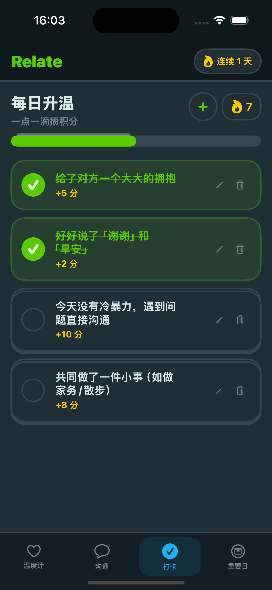
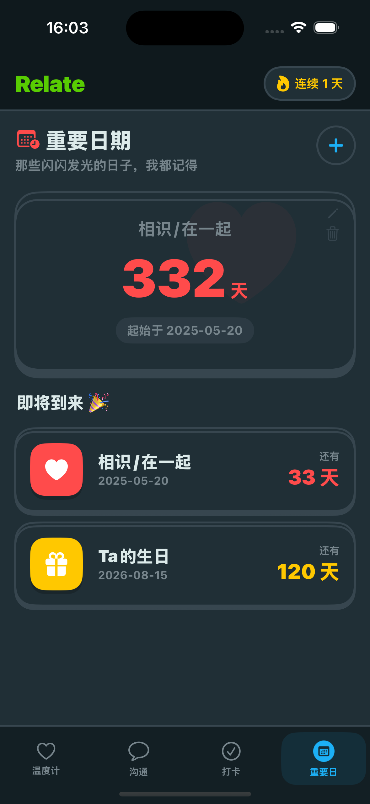

# Relate App

一个现代化的 iOS 应用，用于跟踪和管理人际关系。

## 功能特点

- **签到记录**：记录和跟踪与联系人的互动
- **重要日期**：管理重要的日期和纪念日
- **消息模板**：创建和使用消息模板，确保沟通的一致性
- **关系温度计**：通过交互式温度计可视化关系健康状况
- **主题定制**：通过不同主题自定义应用外观

## 截图





## 系统要求

- iOS 14.0+
- Xcode 12.0+
- Swift 5.0+

## 安装说明

1. 克隆仓库：
   ```bash
   git clone https://github.com/yourusername/relate-app.git
   ```

2. 在 Xcode 中打开项目：
   ```bash
   cd relate-app
   open relate-app.xcodeproj
   ```

3. 在设备或模拟器上构建并运行应用。

## 项目结构

- `relate-app/` - 主应用代码
  - `Assets.xcassets/` - 应用图标和资源
  - `AppStore.swift` - App Store 相关功能
  - `CheckinsView.swift` - 签到功能实现
  - `ContentView.swift` - 应用主视图
  - `DatesView.swift` - 日期功能实现
  - `Models.swift` - 数据模型
  - `TemplatesView.swift` - 模板功能实现
  - `Theme.swift` - 主题功能
  - `ThermometerView.swift` - 关系健康温度计
  - `relate_appApp.swift` - 应用入口点

## 使用方法

1. **签到**：点击 "Checkins" 标签页记录与联系人的互动。
2. **日期**：点击 "Dates" 标签页查看和管理重要日期。
3. **模板**：点击 "Templates" 标签页创建和使用消息模板。
4. **温度计**：在主屏幕上查看关系健康状态。

## 贡献

欢迎贡献！请随时提交 Pull Request。

## 许可证

本项目采用 MIT 许可证 - 详情请参阅 [LICENSE](LICENSE) 文件。

## 致谢

- 使用 SwiftUI 实现现代化的用户界面
- 使用 Core Data 进行本地数据持久化
- 使用 Combine 进行响应式编程